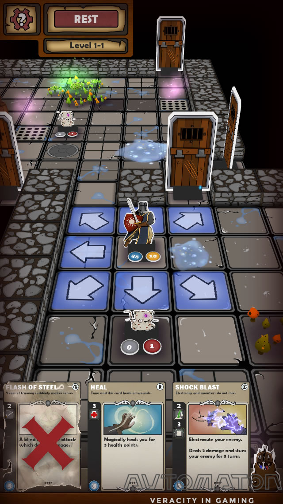
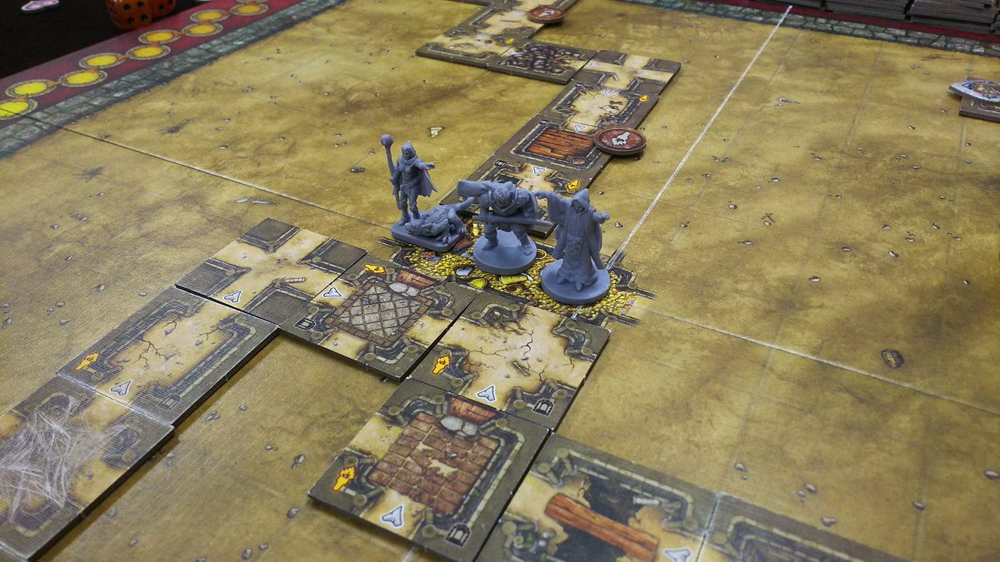

# ボクセルカードローグライト(仮)仕様書

## ゲーム概要
### ジャンル
- ローグライク
- カードゲーム
  - プレイヤーは、前後左右の移動と、カードを使った攻撃が可能

### 見た目
- クウォータービュー
- 雰囲気はボドゲ

- 見た目はボクセル+ピクセル
  - [参考記事](https://note.com/kaifu/n/nec2c14e7dd7a)

### ルール
#### 1ゲームの間
- プレイヤーは自動生成されるダンジョンを登っていき、塔の最上階を目指す
- 自身が行動した後に、エネミーが一回ずつ行動する(オーソドックスなローグライク)
- 選択できる行動は、移動またはカードの使用
  - 移動については、サイコロを振って出た目だけ進む、でも良いかもしれない
    - しかし、敵が進むマスをどうやって決定するのかを考えなければならない上、敵からの逃走が簡単になってしまう
    - その場合、シンボルエンカウント制にしても良いかもしれない
  - カードについて
    - カードは拾う、買う、敵からドロップする
    - カードにはクールタイムが設定されており、一回カードを使用する毎に回復する
    - 一部のカードには回数制限がついている
      - ファントムローズみたいなシステム

#### ゲームの繋ぎ
- 複数ステージを用意する
- 死んだ場合は持っていたアイテムを全ロストする
- クリアした場合、持っていたアイテムを持って帰れる
- それらのアイテムは、次回のダンジョンに持ち込める
- ステージ間ではアイテムの売買が可能

### 制作ツール
- Unity 
- MagicalVoxel
- アニメーション、エフェクトに関しては、アセットを使っても良いものとする

## 工程見積もり
- 基礎設計
  - 直方体を使ってプレイヤー、ステージを作る
  - 移動、カード使用する部分のUI設計
  - メニュー画面の実装
  - プレイヤー、敵の行動順序の制御
  - レベルの自動生成
  - カードシステムの実装
  - アイテムの持ち込み、ロストの実装

- モデリング
  - プレイヤー
  - 敵(n種類)
  - 地面
  - 地面の下の机
  - 背景の小物
    - 木
    - 草
    - 湖
    - 

- エフェクト
  - 攻撃モーション
  - ダメージモーション
  - 移動モーション