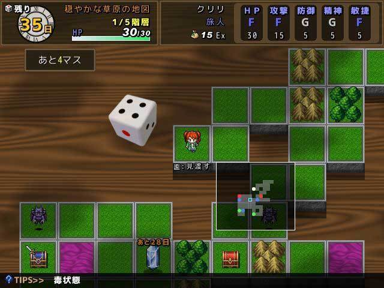

# ボクセルカードローグライト(仮)仕様書

## ゲーム概要
### ジャンル
- ローグライク
  - プレイヤーは、前後左右の移動と、カードを使った攻撃が可能
### 見た目
- クウォータービュー
- 雰囲気はボドゲ

- 見た目はボクセル+ピクセル
  - [参考記事](https://note.com/kaifu/n/nec2c14e7dd7a)

### ルール
#### 1ゲームの間
- プレイヤーは自動生成されるダンジョンを登っていき、塔の最上階を目指す
- 自身が行動した後に、エネミーが一回ずつ行動する(オーソドックスなローグライク)
- 選択できる行動は、移動またはカードの使用
  - 移動については、サイコロを振って出た目だけ進む、でも良いかもしれない
    - しかし、敵が進むマスをどうやって決定するのかを考えなければならない上、敵からの逃走が簡単になってしまう
    - その場合、シンボルエンカウント制にしても良いかもしれない
#### カード
- カードは拾う、買う、敵からドロップする

  

- カードはデッキからランダム入手では無く、全てのカードを一気に使える
- 最初に使えるカードの数は少ないが、徐々に増えていく
- カードの使用にはマナが必要
  - マナは以下の方法で回復できる
    - 店で売っているアイテム

- 手に入れたカードは何度でも使用可能
  - そういう意味ではカードというよりも特殊能力に近い

- 最初から持っているカードがn種類ある
  - 通常攻撃

#### 宝箱
- 宝箱からは以下のアイテムが手に入る
  - HP回復薬
  - マナ回復薬
  - カード
  - お金
#### 敵
- 敵は自分と同じようにカードを使って攻撃してくる
  - しかしマナの概念は無く、無限にカード使ってくる
  - 倒した時にお金とマナを落とす
  - 一定確率で使用しているカードを落とす
#### ゲームの繋ぎ
- 複数ステージを用意する
- 死んだ場合は持っていたアイテムを全ロストする
- ステージ間ではアイテムの売買が可能

#### 引き継ぎ要素
- 死んだ時点で持っていたカードの中からn種類
- 死んだ時点で持っていたお金からn円
- プレイヤーの能力
  - 持てるカードの数
  - HPの上限
  - マナの上限
  - ドロップ率
  - 攻撃力に対する補正
  - 

#### 操作方法
- 移動
  - 「DangeouQuest」を参考にする
    - クリックした場所に移動する
 
  

- カードの使用
  - 下に表示されているカードをフリックして使用
    - カードをクリックすると大きくなる
      - それを画面上部にもっていって離すと発動する

### 制作ツール
- Unity 
- MagicalVoxel
- アニメーション、エフェクトに関しては、アセットを使っても良いものとする

## 工程見積もり
- 基礎設計
  - 直方体を使ってプレイヤー、ステージを作る
  - 移動、カード使用する部分のUI設計
  - メニュー画面の実装
  - プレイヤー、敵の行動順序の制御
  - レベルの自動生成
  - カードシステムの実装
  - アイテムの持ち込み、ロストの実装

- モデリング
  - プレイヤー
  - 敵(n種類)
  - 地面
  - 地面の下の机
  - 背景の小物
    - 木
    - 草
    - 湖
    - 

- エフェクト
  - 攻撃モーション
  - ダメージモーション
  - 移動モーション

## 演出
### プレイヤーや敵の移動
- ボドゲの駒のように、ぴょんぴょん跳ねながら移動する
- 攻撃などについても、派手なアクションはしない
  - ただし、エフェクト(炎など)は派手にする

### フィールド間の移動
- ゴールとなるマスまで移動したらぴょーんって跳ねて次のステージまで移動する
  - または手が伸びてきて、駒をつかんでいく

## 面白さ
- カードの組み合わせを見つける楽しさ
